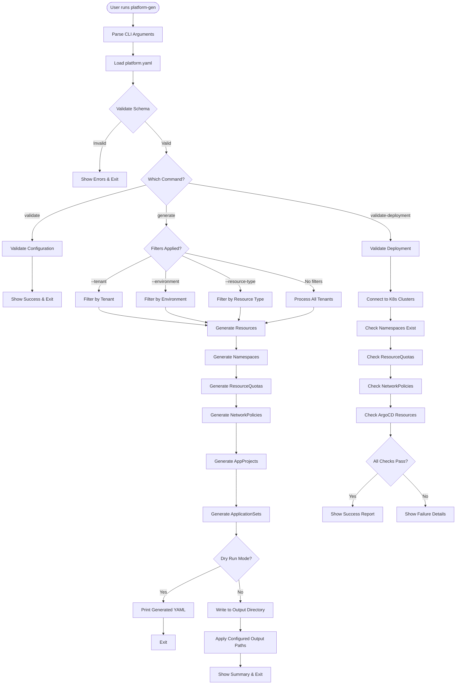

# GitOps Platform Generator CLI

A Python CLI tool for generating Kubernetes and ArgoCD manifests from declarative YAML configuration, designed for multi-tenant GitOps deployments.

## Features

- **Multi-tenant Support**: Generate resources for multiple tenants with isolated configurations
- **Multi-environment**: Support for dev, stage, prod, and custom environments
- **Multi-cluster**: Deploy across multiple Kubernetes clusters per environment
- **Auto-generation**: Automatically generate namespaces for all clusters
- **Network Policies**: Create Cilium NetworkPolicies with 4 policy types (deny-all, allow-namespace, allow-ingress, custom CIDR)
- **ArgoCD Integration**: Generate AppProjects and ApplicationSets with Git Generator
- **Configurable Output Paths**: Customize where each resource type is written
- **YAML Validation**: Validate generated YAML files for syntax errors before deployment
- **Git Operations**: Automatic branch creation, commits, and pushes for GitOps workflows
- **Post-deployment Validation**: Verify resources are correctly deployed to clusters (planned)
- **Rich CLI Output**: Beautiful terminal output with colors and tables

## Installation

### Using pip

```bash
# From source
git clone https://github.com/your-org/platform-generator.git
cd platform-generator
pip install -e .
```

### Using UV (recommended for fast dependency management)

```bash
# Install UV first
curl -LsSf https://astral.sh/uv/install.sh | sh

# Clone and install
git clone https://github.com/your-org/platform-generator.git
cd platform-generator
uv pip install -e .
```

## Quick Start

1. Create or use an existing `platform.yaml` configuration file (see `docs/platform.yaml` for example)

2. Validate your configuration:
```bash
platform-gen validate --config platform.yaml
```

3. Generate manifests:
```bash
platform-gen generate --config platform.yaml
```

4. Validate generated YAML files:
```bash
platform-gen validate-output --path generated/
```

5. (Optional) Review and commit changes:
```bash
cd generated/
git status
git add .
git commit -m "Update platform manifests"
git push
```

Or enable automatic git operations in `platform.yaml`:
```yaml
cli-config:
  git-enabled: true
  git-auto-push: true
```

## CLI Commands

### Command Reference

| Command | Purpose | Status |
|---------|---------|--------|
| `validate` | Validate platform.yaml configuration | ✅ Available |
| `generate` | Generate Kubernetes/ArgoCD manifests | ✅ Available |
| `validate-output` | Validate generated YAML syntax | ✅ Available |
| `validate-deployment` | Validate deployed resources | ⚠️ Planned |

### `platform-gen validate`

Validate the configuration file without generating manifests.

```bash
platform-gen validate --config platform.yaml
```

**Options:**
- `--config, -c PATH`: Path to platform.yaml (default: `platform.yaml`)

### `platform-gen generate`

Generate Kubernetes and ArgoCD manifests.

```bash
platform-gen generate [OPTIONS]
```

**Options:**
- `--config, -c PATH`: Path to platform.yaml (default: `platform.yaml`)
- `--tenant, -t TEXT`: Generate for specific tenant only
- `--environment, -e TEXT`: Generate for specific environment only
- `--resource-type TEXT`: Generate specific resource type only (namespace, quota, policy, appproject, applicationset)
- `--dry-run`: Print what would be generated without writing files
- `--verbose, -v`: Verbose output

**Examples:**
```bash
# Generate all resources for all tenants
platform-gen generate

# Generate only for tenant "bar"
platform-gen generate --tenant bar

# Generate only dev environment resources
platform-gen generate --environment dev

# Generate only namespaces
platform-gen generate --resource-type namespace

# Dry-run to preview what would be generated
platform-gen generate --dry-run

# Combine filters
platform-gen generate --tenant bar --environment dev --dry-run
```

### `platform-gen validate-output`

Validate generated YAML files for correct syntax.

```bash
platform-gen validate-output --path PATH
```

**Options:**
- `--path, -p PATH`: Path to YAML file or directory to validate (required)

**Description:**

This command validates that generated YAML files can be parsed correctly. It's useful for:
- Catching template rendering errors before deployment
- Validating syntax after making template changes
- CI/CD integration to ensure manifests are well-formed
- Debugging YAML parsing issues

The command accepts either a single file or a directory. When given a directory, it recursively finds all `.yaml` and `.yml` files and validates each one.

**Examples:**

```bash
# Validate a single file
platform-gen validate-output --path generated/tenants/bar/namespaces/dev/namespace.yaml

# Validate all files in a directory
platform-gen validate-output --path generated/tenants/bar/networkpolicies/dev/

# Validate all generated files
platform-gen validate-output --path generated/

# Short form
platform-gen validate-output -p generated/
```

**Output Example:**

```
Validating YAML files: generated/tenants/bar/networkpolicies/dev

Found 5 YAML file(s) to validate

✓ allow-same-namespace.yaml
✓ deny-all.yaml
✗ allow-from-ingress.yaml
  sequence entries are not allowed here

Validation Summary:
  ✓ 2 file(s) valid
  ✗ 1 file(s) invalid

Validation Errors:

generated/tenants/bar/networkpolicies/dev/allow-from-ingress.yaml
  sequence entries are not allowed here
  in "allow-from-ingress.yaml", line 16, column 15
```

**Exit Codes:**
- `0`: All files valid
- `1`: One or more files invalid or error occurred

### `platform-gen validate-deployment`

⚠️ **Note: This command is not yet implemented.**

Validate that resources were correctly deployed to Kubernetes clusters.

```bash
platform-gen validate-deployment --tenant TENANT --environment ENV [OPTIONS]
```

**Options:**
- `--config, -c PATH`: Path to platform.yaml (default: `platform.yaml`)
- `--tenant, -t TEXT`: Tenant to validate (required)
- `--environment, -e TEXT`: Environment to validate (required)
- `--kubeconfig PATH`: Path to kubeconfig file
- `--context TEXT`: Kubernetes context to use

**Planned Features:**

When implemented, this command will validate:
- Namespaces exist in all expected clusters
- ResourceQuotas are applied with correct limits
- Cilium NetworkPolicies exist (all 4 types)
- ArgoCD AppProject exists in control plane
- ArgoCD ApplicationSets exist with correct configuration

**Example:**

```bash
platform-gen validate-deployment \
  --tenant bar \
  --environment dev \
  --kubeconfig ~/.kube/config \
  --context my-dev-cluster
```

## CLI Process Flow



## Configuration Reference

### platform.yaml Structure

```yaml
version: v1

metadata:
  description: "GitOps Platform Generator configuration"

cli-config:
  output-directory: "./generated"
  validate-before-apply: true
  dry-run-default: true
  git-commit-message-template: "chore: update {{tenant}}/{{app}}"
  # Git operations (optional)
  git-enabled: false  # Set to true to enable automatic git operations
  git-branch-pattern: "feat/platform-{{tenant}}-{{env}}-{{timestamp}}"
  git-auto-push: true
  output-paths:
    namespaces: "tenants/{{tenant}}/namespaces/{{env}}/{{cluster}}"
    resource-quotas: "tenants/{{tenant}}/resourcequotas/{{env}}"
    network-policies: "tenants/{{tenant}}/networkpolicies/{{env}}"
    app-projects: "tenants/{{tenant}}/argocd/appprojects/{{env}}"
    application-sets: "tenants/{{tenant}}/argocd/applicationsets/{{app}}/{{env}}"

defaults:
  environments:
    - dev
    - stage
    - prod

akp-instances:
  akp-dev:
    environment: dev
    url: "https://dev.akp.example.com"
    appproject-namespace: "argocd"

platform-clusters:
  dev-wus3:
    name: example-gitops-wus3-dev
    env: dev
    region: wus3

tenants:
  - name: tenant-example
    short-name: example
    long-name: "Example Tenant"
    description: "GitOps Tenant for Example Team"

    namespace-config:
      naming-pattern: "{{short-name}}-gitops-{{env}}"
      auto-generate-per-cluster: true

    namespaces:
      dev: example-gitops-dev
      stage: example-gitops-stage
      prod: example-gitops-prod

    resource-quotas:
      - dev:
          cpu: "10"
          memory: "20Gi"

    network-policies:
      enabled: true
      default-deny-all: true
      allow-within-namespace: true
      allow-from-ingress:
        enabled: true
        ingress-controller-namespaces:
          - ingress-nginx
      custom-rules:
        - name: allow-to-database
          description: "Allow egress to database"
          policy-type: egress
          egress:
            - to:
              - ipBlock:
                  cidr: 10.100.0.0/16
              ports:
                - protocol: TCP
                  port: 5432

    appproject:
      description: "AppProject for Example Team"
      source-repos:
        - "https://github.com/example-org/*"
      destinations:
        dev:
          - cluster: "example-gitops-wus3-dev"
            namespace: "example-gitops-dev"

    applications:
      - name: example-app
        argo-app-type: applicationset
        generator-type: git-generator
        repo-url: "https://github.com/example-org/example-app"
        config-repo:
          url: "https://github.com/example-org/example-config"
          revision: HEAD
          files:
            - path: "apps/*/config.json"
        environments:
          dev:
            - cluster: dev-wus3
              repo-path: "manifests/dev"
              sync-policy:
                automated:
                  prune: true
                  selfHeal: true
```

### Output Path Templates

Configure where each resource type is written using template variables:

**Available Variables:**
- `{{tenant}}` - Tenant name or short-name
- `{{env}}` - Environment name (dev/stage/prod)
- `{{cluster}}` - Cluster name
- `{{app}}` - Application name

**Default Paths:**
```yaml
output-paths:
  namespaces: "tenants/{{tenant}}/namespaces/{{env}}/{{cluster}}"
  resource-quotas: "tenants/{{tenant}}/resourcequotas/{{env}}"
  network-policies: "tenants/{{tenant}}/networkpolicies/{{env}}"
  app-projects: "tenants/{{tenant}}/argocd/appprojects/{{env}}"
  application-sets: "tenants/{{tenant}}/argocd/applicationsets/{{app}}/{{env}}"
```

### Generated Resources

The CLI generates the following Kubernetes and ArgoCD resources:

1. **Namespaces** - Auto-generated for every cluster in each environment
2. **ResourceQuotas** - CPU and memory limits per environment
3. **Cilium NetworkPolicies** - 4 types:
   - `deny-all.yaml` - Default deny ingress/egress
   - `allow-namespace.yaml` - Allow pod-to-pod within namespace
   - `allow-ingress.yaml` - Allow from ingress controllers
   - `custom-{name}.yaml` - Custom CIDR-based rules
4. **ArgoCD AppProjects** - One per tenant per environment
5. **ArgoCD ApplicationSets** - With Git Generator for self-service deployments

## ArgoCD ApplicationSets

### What are ApplicationSets?

ArgoCD ApplicationSets are a powerful pattern for generating multiple ArgoCD Applications from a single template. They act as an "application factory" that dynamically creates and manages many Applications based on configuration data. This is particularly useful in multi-tenant, multi-cluster environments where you need to deploy the same application across different clusters or namespaces with slight variations.

Instead of manually creating dozens or hundreds of individual Application manifests, an ApplicationSet reads configuration from a data source (like Git files, cluster lists, or matrices) and generates Applications automatically. This approach provides:

- **Self-service deployments**: Teams can add new applications by simply updating a config file
- **Consistency**: All generated Applications follow the same template structure
- **Multi-cluster management**: Deploy to multiple clusters from a single ApplicationSet
- **Reduced boilerplate**: One ApplicationSet replaces many Application manifests
- **GitOps-friendly**: Configuration changes trigger automatic Application updates

### Git Generator Pattern

The **Git Generator** is one of several generators available in ApplicationSets. It discovers applications by reading JSON or YAML files from a Git repository. This is the pattern used by this platform generator.

**How It Works**:

1. The ApplicationSet points to a Git repository and file path pattern (e.g., `apps/*/config.json`)
2. ArgoCD periodically polls the Git repository for changes
3. For each file matching the pattern, ArgoCD reads the JSON/YAML content
4. Variables from the file (like `name`, `cluster`, `namespace`) are available as template variables
5. ArgoCD generates one Application per config file, substituting variables into the template
6. When config files are added, removed, or modified, Applications are created, deleted, or updated accordingly

**Benefits of Git Generator**:

- Configuration lives in Git alongside application code or manifests
- Teams can add new applications without modifying the ApplicationSet itself
- Changes are tracked through Git history and PR reviews
- Supports glob patterns to discover config files dynamically
- Enables true self-service: developers control their own deployments

### Template Architecture: Double-Templating

This platform generator uses a unique **double-templating** pattern to create ApplicationSets:

```
platform.yaml → Jinja2 → ApplicationSet YAML (with Go templates) → ArgoCD → Applications
```

**The Two Template Layers**:

1. **Jinja2 Layer** (generation time):
   - Processes `platform.yaml` configuration
   - Renders ApplicationSet YAML manifest
   - Substitutes values like repository URLs, namespaces, labels
   - Uses `...` blocks to preserve ArgoCD variables

2. **Go Template Layer** (runtime in ArgoCD):
   - Processes config.json files from Git Generator
   - Substitutes values like app names, clusters, paths
   - Uses `{{.variable}}` syntax (ArgoCD's Go templating)
   - Runs inside ArgoCD when creating Applications

**Why Double-Templating?**

The ApplicationSet YAML itself contains template variables that ArgoCD will process later. We need Jinja2 to generate the ApplicationSet without processing these ArgoCD-specific variables. The `` blocks tell Jinja2: "Don't touch this - it's for ArgoCD to process later."

**Example**:

```jinja2
# Jinja2 template (applicationset.yaml.j2)
metadata:
  name: {{ applicationset_name }}  # Processed by Jinja2 → "my-app-dev"
  namespace: {{ namespace }}        # Processed by Jinja2 → "argocd"

template:
  metadata:
    name: '{{.name}}'  # Preserved for ArgoCD → '{{.name}}'
  spec:
    destination:
      cluster: '{{.cluster}}'  # Preserved for ArgoCD → '{{.cluster}}'
```

After Jinja2 processing, the ApplicationSet contains literal `{{.name}}` and `{{.cluster}}` which ArgoCD will substitute when reading config.json files.

### Generated ApplicationSet Structure

Here's an example of a generated ApplicationSet:

```yaml
apiVersion: argoproj.io/v1alpha1
kind: ApplicationSet
metadata:
  name: my-app-dev
  namespace: argocd
  labels:
    app.kubernetes.io/name: parent-bootstrap-appset
    app.kubernetes.io/instance: argocd-applicationset
    gitops.example.com/bootstrap-role: "parent"
    gitops.example.com/bootstrap-app: "true"
  annotations:
    argocd.argoproj.io/enable-prune: "true"
spec:
  # Enable Go templating for ArgoCD to process
  goTemplate: true
  goTemplateOptions: ["missingkey=error"]

  generators:
    # Git generator reads config files from repository
    - git:
        repoURL: https://github.com/example-org/app-config
        revision: main
        files:
          - path: "apps/*/config.json"

  template:
    metadata:
      # ArgoCD substitutes {{.name}} from config.json
      name: '{{.name}}'
      labels:
        app.kubernetes.io/instance: argocd-application
        gitops.example.com/bootstrap-role: "child"

    spec:
      # ArgoCD substitutes {{.project}} from config.json
      project: '{{.project}}'

      source:
        # ArgoCD substitutes {{.source}}, {{.revision}}, {{.manifestPath}}
        repoURL: '{{.source}}'
        targetRevision: '{{.revision}}'
        path: '{{.manifestPath}}'
        directory:
          recurse: false

      destination:
        # ArgoCD substitutes {{.cluster}} and {{.namespace}}
        name: '{{.cluster}}'
        namespace: '{{.namespace}}'

      syncPolicy:
        automated:
          selfHeal: true
          prune: true
        syncOptions:
          - CreateNamespace=true
          - ApplyOutOfSyncOnly=true
        retry:
          limit: 5
          backoff:
            duration: 5s
            factor: 2
            maxDuration: 3m
```

### Bootstrap Labeling Strategy

The generated ApplicationSets use a **parent/child labeling strategy** to distinguish between the ApplicationSet itself and the Applications it creates:

**Parent Labels** (on ApplicationSet):
```yaml
labels:
  app.kubernetes.io/name: parent-bootstrap-appset
  app.kubernetes.io/instance: argocd-applicationset
  app.kubernetes.io/component: parent-applicationset
  gitops.example.com/bootstrap-role: "parent"
  gitops.example.com/bootstrap-app: "true"
```

**Child Labels** (on generated Applications):
```yaml
labels:
  app.kubernetes.io/instance: argocd-application
  app.kubernetes.io/component: child-application
  gitops.example.com/bootstrap-role: "child"
  gitops.example.com/bootstrap-app: "true"
```

**Purpose**:

- **Traceability**: Easily identify which Applications came from which ApplicationSet
- **Lifecycle management**: Parent/child relationships help with cascading deletes
- **Queries**: Label selectors can find all "parent" ApplicationSets or all "child" Applications
- **Automation**: Tools can discover bootstrap applications via the `bootstrap-app` label

### goTemplate Configuration

The `goTemplate: true` setting is critical for this pattern to work:

```yaml
spec:
  goTemplate: true
  goTemplateOptions: ["missingkey=error"]
```

**What it does**:

- Enables Go template syntax (` {{.variable}}`) in the ApplicationSet template
- Without this, ArgoCD uses simple string replacement which has limitations
- `missingkey=error` causes ArgoCD to fail if a required variable is missing from config.json

**Variable Syntax**:

- **With goTemplate**: `{{.name}}`, `{{.cluster}}`, `{{.project}}` (dot notation)
- **Without goTemplate**: `{{name}}`, `{{cluster}}`, `{{project}}` (no dot)

This generator uses `goTemplate: true` for better error handling and more expressive templates.

### Data Flow Diagram

```
┌─────────────────┐
│ platform.yaml   │  Configuration file
│  - tenants      │
│  - applications │
│  - clusters     │
└────────┬────────┘
         │
         │ platform-gen generate
         ▼
┌─────────────────┐
│ Generator       │  Python code
│  - Reads config │
│  - Renders      │
│    Jinja2       │
└────────┬────────┘
         │
         │ Generates 2 files
         ├─────────────────┬──────────────────┐
         ▼                 ▼                  ▼
┌──────────────┐   ┌──────────────┐   ┌──────────────┐
│ ApplicationSet│   │ config.json  │   │ config.json  │
│    YAML       │   │   (dev)      │   │  (prod)      │
│               │   │              │   │              │
│ Contains Go   │   │ [            │   │ [            │
│ templates:    │   │   {          │   │   {          │
│  {{.name}}    │   │     "name":  │   │     "name":  │
│  {{.cluster}} │   │     "cluster"│   │     "cluster"│
│               │   │   }          │   │   }          │
│               │   │ ]            │   │ ]            │
└───────┬───────┘   └──────┬───────┘   └──────┬───────┘
        │                  │                  │
        │ Applied to       │                  │
        │ ArgoCD           │ Git Generator    │
        │                  │ reads these      │
        │                  │                  │
        ▼                  ▼                  ▼
┌─────────────────────────────────────────────┐
│              ArgoCD Controller              │
│  - Reads ApplicationSet                     │
│  - Polls config.json files                  │
│  - Substitutes Go template variables        │
│  - Creates Applications                     │
└────────────────┬────────────────────────────┘
                 │
                 │ Generates
                 ▼
    ┌────────────────────────────┐
    │   ArgoCD Applications      │
    │                            │
    │   app1-cluster1-dev        │
    │   app1-cluster2-dev        │
    │   app1-cluster1-prod       │
    │   app1-cluster2-prod       │
    │   ...                      │
    └────────────────────────────┘
```

### Example: From Config to Application

**Input**: `config.json`
```json
{
  "name": "my-app-cluster1-prod",
  "source": "https://github.com/example-org/my-app",
  "revision": "main",
  "manifestPath": "k8s/prod",
  "project": "platform-team",
  "namespace": "my-app-prod",
  "cluster": "prod-us-east-1"
}
```

**ApplicationSet Template** (snippet):
```yaml
template:
  metadata:
    name: '{{.name}}'
  spec:
    project: '{{.project}}'
    source:
      repoURL: '{{.source}}'
      path: '{{.manifestPath}}'
    destination:
      name: '{{.cluster}}'
      namespace: '{{.namespace}}'
```

**Generated Application**:
```yaml
apiVersion: argoproj.io/v1alpha1
kind: Application
metadata:
  name: my-app-cluster1-prod
spec:
  project: platform-team
  source:
    repoURL: https://github.com/example-org/my-app
    path: k8s/prod
  destination:
    name: prod-us-east-1
    namespace: my-app-prod
```

ArgoCD substitutes all `{{.variable}}` placeholders with values from `config.json`, creating a fully-formed Application manifest.

## Jinja2 Templates

This platform generator uses Jinja2 templates to generate all Kubernetes and ArgoCD manifests. Understanding how these templates work is essential for customizing or extending the generator.

### Template Environment Setup

All generators inherit from `BaseGenerator` which configures the Jinja2 environment with these settings:

```python
Environment(
    loader=FileSystemLoader(str(template_dir)),
    trim_blocks=True,
    lstrip_blocks=True,
)
```

**Key settings**:
- `trim_blocks=True`: Removes the first newline after a template tag (e.g., ``, ``)
- `lstrip_blocks=True`: Strips leading whitespace before block tags on their line

These settings help produce clean YAML output without excessive blank lines or indentation issues. However, be careful with the `-` trim control:

- **Avoid**: `` - This strips all preceding whitespace and can cause single-line concatenation
- **Prefer**: `` - Works correctly with `trim_blocks` for proper YAML formatting

### Variable Substitution

The simplest template pattern is variable substitution using `{{ variable }}` syntax:

**Template**:
```jinja2
apiVersion: v1
kind: Namespace
metadata:
  name: {{ namespace_name }}
```

**Context** (from generator):
```python
context = {
    "namespace_name": "my-app-prod"
}
content = template.render(**context)
```

**Output**:
```yaml
apiVersion: v1
kind: Namespace
metadata:
  name: my-app-prod
```

Variables in the context dictionary become available in templates. Use double curly braces `{{ }}` for variable substitution.

### For Loops - Dictionary Iteration

The most common pattern is iterating over dictionaries to generate labels and annotations. Use `.items()` to get key-value pairs:

**Template Pattern**:
```jinja2
metadata:
  labels:

    {{ key }}: "{{ value }}"

```

**Context**:
```python
context = {
    "labels": {
        "app": "my-app",
        "environment": "prod",
        "team": "platform"
    }
}
```

**Output**:
```yaml
metadata:
  labels:
    app: "my-app"
    environment: "prod"
    team: "platform"
```

**Key points**:
- Use `.items()` to iterate over dictionary key-value pairs
- Indentation must match YAML requirements (consistent spaces)
- Values are quoted with `"{{ value }}"` for string safety
- Each iteration produces one label/annotation line

**Example from namespace.yaml.j2**:
```jinja2
apiVersion: v1
kind: Namespace
metadata:
  name: {{ namespace_name }}
  labels:

    {{ key }}: "{{ value }}"


  annotations:

    {{ key }}: "{{ value }}"


```

### For Loops - List Iteration

Lists are iterated with `for item in list` syntax, commonly used for repositories, destinations, and config files:

**Pattern 1 - Simple List**:
```jinja2
spec:
  sourceRepos:

    - {{ repo }}

```

**Context**:
```python
context = {
    "source_repos": [
        "https://github.com/example-org/app1",
        "https://github.com/example-org/app2",
        "https://github.com/example-org/*"
    ]
}
```

**Output**:
```yaml
spec:
  sourceRepos:
    - https://github.com/example-org/app1
    - https://github.com/example-org/app2
    - https://github.com/example-org/*
```

**Pattern 2 - List of Objects**:
```jinja2
destinations:

  - namespace: {{ dest.namespace }}
    server: {{ dest.server }}
    name: {{ dest.name }}

```

**Context**:
```python
context = {
    "destinations": [
        {"namespace": "app-prod", "server": "https://prod-cluster", "name": "prod-us-east"},
        {"namespace": "app-prod", "server": "https://prod-cluster-2", "name": "prod-us-west"}
    ]
}
```

**Output**:
```yaml
destinations:
  - namespace: app-prod
    server: https://prod-cluster
    name: prod-us-east
  - namespace: app-prod
    server: https://prod-cluster-2
    name: prod-us-west
```

**Key points**:
- Access object properties with dot notation: `dest.namespace`, `dest.server`
- Maintain proper YAML list indentation with `- ` prefix
- Works with Pydantic models (generators pass model objects directly)

**Example from appproject.yaml.j2**:
```jinja2
spec:
  description: {{ description }}
  sourceRepos:

    - {{ repo }}

  destinations:

    - namespace: {{ dest.namespace }}
      server: {{ dest.server }}
      name: {{ dest.name }}

```

### Conditional Rendering

Use `` blocks to conditionally include template sections:

**Pattern**:
```jinja2

  annotations:

    {{ key }}: "{{ value }}"


```

**How it works**:
- If `annotations` is `None`, empty dict, or `False`, the entire block is skipped
- If `annotations` exists and has items, the annotations section is rendered
- The `` with hyphen strips preceding whitespace for cleaner output

**Complex Example** (from networkpolicy/allow-ingress.yaml.j2):
```jinja2
spec:
  endpointSelector: {}
  ingress:


    - fromEndpoints:
      - matchLabels:
          k8s:io.kubernetes.pod.namespace: {{ ns }}




    - fromEndpoints:
      - matchLabels:

          {{ key }}: {{ value }}



```

This pattern:
1. Checks if `ingress_namespaces` exists
2. If yes, iterates and creates ingress rules for each namespace
3. Checks if `ingress_labels` exists
4. If yes, iterates over label sets and their key-value pairs
5. Creates nested YAML structure with proper indentation

### Double-Templating Pattern (Advanced)

The **most critical pattern** for ApplicationSets: preserving ArgoCD Go template variables while processing Jinja2 templates.

**Problem**: ApplicationSet YAML contains `{{.name}}`, `{{.cluster}}` which ArgoCD processes. But Jinja2 would try to substitute these variables during generation, causing errors.

**Solution**: Use `...` blocks to tell Jinja2 to leave the contents untouched.

**Example from applicationset.yaml.j2**:
```jinja2
# Jinja2 processes these variables (no  block)
metadata:
  name: {{ applicationset_name }}
  namespace: {{ namespace }}

spec:
  goTemplate: true

  generators:
    - git:
        repoURL: {{ config_repo_url }}
        revision: {{ config_repo_revision }}

  template:
    metadata:
      # Jinja2 does NOT process this - preserved for ArgoCD
      name: '{{.name}}'

      labels:

        {{ key }}: "{{ value }}"


    spec:
      # Jinja2 does NOT process these - preserved for ArgoCD
      project: '{{.project}}'

      source:
        repoURL: '{{.source}}'
        targetRevision: '{{.revision}}'
        path: '{{.manifestPath}}'

      destination:
        name: '{{.cluster}}'
        namespace: '{{.namespace}}'
```

**After Jinja2 processing**, the output contains:
```yaml
name: '{{.name}}'
project: '{{.project}}'
source:
  repoURL: '{{.source}}'
  path: '{{.manifestPath}}'
destination:
  name: '{{.cluster}}'
  namespace: '{{.namespace}}'
```

ArgoCD then processes these `{{.variable}}` placeholders when reading config.json files.

**Key points**:
- `` starts a literal block (Jinja2 ignores everything inside)
- `` ends the literal block
- Used exclusively for preserving ArgoCD/Go template syntax
- The generated YAML contains literal `{{.variable}}` text
- ArgoCD processes these at runtime, not at generation time

### Template Context: How Generators Pass Data

Each generator builds a **context dictionary** and passes it to the template via `template.render(**context)`:

**Example from NamespaceGenerator**:
```python
context = {
    "namespace_name": "my-app-prod",
    "labels": {
        "platform.example.com/tenant": "example",
        "platform.example.com/environment": "prod",
        "app": "my-app"
    },
    "annotations": {
        "description": "Production namespace for my-app"
    }
}
content = template.render(**context)
```

**Example from ApplicationSetGenerator**:
```python
context = {
    "applicationset_name": "my-app-dev",
    "namespace": "argocd",
    "labels": {
        "platform.example.com/tenant": "example",
        "platform.example.com/environment": "dev"
    },
    "config_repo_url": "https://github.com/example-org/config",
    "config_repo_revision": "main",
    "config_repo_files": [
        {"path": "apps/*/config.json"}
    ],
    "akp_instance_url": "https://argocd.example.com"
}
content = template.render(**context)
```

**Key points**:
- Context is a simple Python dictionary
- Dictionary keys become template variables
- Values can be strings, dicts, lists, or Pydantic models
- Nested objects use dot notation: `obj.property`
- Lists use iteration: `for item in list`

### Template Examples by Resource Type

#### Namespace Template

**File**: `src/platform_generator/templates/namespace.yaml.j2`

**Pattern**: Simple variable substitution + label/annotation iteration

```jinja2
apiVersion: v1
kind: Namespace
metadata:
  name: {{ namespace_name }}
  labels:

    {{ key }}: "{{ value }}"


  annotations:

    {{ key }}: "{{ value }}"


```

**Usage**:
- Variables: `namespace_name`, `labels`, `annotations`
- Patterns: Dictionary iteration, conditional rendering
- Complexity: Low

#### ResourceQuota Template

**File**: `src/platform_generator/templates/resourcequota.yaml.j2`

**Pattern**: Simple variables + resource specifications

```jinja2
apiVersion: v1
kind: ResourceQuota
metadata:
  name: {{ quota_name }}
  namespace: {{ namespace }}
  labels:

    {{ key }}: "{{ value }}"

spec:
  hard:
    requests.cpu: "{{ cpu }}"
    requests.memory: "{{ memory }}"
    limits.cpu: "{{ cpu }}"
    limits.memory: "{{ memory }}"
```

**Usage**:
- Variables: `quota_name`, `namespace`, `labels`, `cpu`, `memory`
- Patterns: Dictionary iteration, simple substitution
- Complexity: Low

#### AppProject Template

**File**: `src/platform_generator/templates/argocd/appproject.yaml.j2`

**Pattern**: List iteration for repos and destinations

```jinja2
# Deploy to AKP instance: {{ akp_instance_url }}
apiVersion: argoproj.io/v1alpha1
kind: AppProject
metadata:
  name: {{ project_name }}
  namespace: {{ namespace }}
  labels:

    {{ key }}: "{{ value }}"

spec:
  description: {{ description }}
  sourceRepos:

    - {{ repo }}

  destinations:

    - namespace: {{ dest.namespace }}
      server: {{ dest.server }}
      name: {{ dest.name }}

```

**Usage**:
- Variables: `project_name`, `namespace`, `labels`, `source_repos`, `destinations`
- Patterns: List iteration (simple and object lists), dictionary iteration
- Complexity: Medium

#### NetworkPolicy Template (Complex)

**File**: `src/platform_generator/templates/networkpolicy/allow-ingress.yaml.j2`

**Pattern**: Nested conditionals and list iteration

```jinja2
apiVersion: "cilium.io/v2"
kind: CiliumNetworkPolicy
metadata:
  name: allow-from-ingress
  namespace: {{ namespace }}
  labels:

    {{ key }}: "{{ value }}"

spec:
  endpointSelector: {}
  ingress:


    - fromEndpoints:
      - matchLabels:
          k8s:io.kubernetes.pod.namespace: {{ ns }}




    - fromEndpoints:
      - matchLabels:

          {{ key }}: {{ value }}



```

**Usage**:
- Variables: `namespace`, `labels`, `ingress_namespaces`, `ingress_labels`
- Patterns: Multiple conditionals, nested for loops, list and dictionary iteration
- Complexity: High

### Best Practices

1. **Maintain proper YAML indentation**:
   - Use spaces (not tabs)
   - Be consistent with indentation levels
   - Test generated YAML with `yamllint` or `platform-gen validate-output`

2. **Use meaningful variable names**:
   - Good: `namespace_name`, `source_repos`, `destination_namespace`
   - Bad: `name`, `repos`, `ns`

3. **Quote string values in labels/annotations**:
   - Use `"{{ value }}"` not `{{ value }}`
   - Prevents YAML parsing errors with special characters

4. **Use conditionals for optional sections**:
   - Wrap optional fields in ``
   - Prevents empty or null values in generated YAML

5. **Leverage `` blocks sparingly**:
   - Only use for preserving other templating syntax (Go templates, Helm, etc.)
   - Don't use for escaping quotes or special characters

6. **Test templates with real data**:
   - Use `platform-gen generate --dry-run` to preview output
   - Validate with `platform-gen validate-output`

## Config.json Files

Config.json files are a critical component of the Git Generator pattern used in ApplicationSets. They describe which applications should be deployed to which clusters, serving as the data source that drives ArgoCD's application creation.

### Purpose

The config.json file serves as a **deployment manifest** that tells ArgoCD:
- **What** application to deploy (source repository and path)
- **Where** to deploy it (cluster and namespace)
- **How** to identify it (name and project)

These files are auto-generated by the platform generator based on your `platform.yaml` configuration, eliminating the need to manually create and maintain deployment specs for each application and cluster combination.

**Key benefits**:
- **Single source of truth**: `platform.yaml` drives both ApplicationSet and config.json generation
- **Self-service**: Teams can add new deployments by updating one file
- **Consistency**: All config.json files follow the same structure
- **Traceability**: Generated from declarative configuration, not manual editing

### File Structure

Config.json files are JSON arrays containing application deployment objects. Each object represents one application deployment to one cluster.

**Schema**:
```json
[
  {
    "name": "string",           // Application name (must be unique in ArgoCD)
    "source": "string",         // Git repository URL for application manifests
    "revision": "string",       // Git branch/tag/commit (typically "main")
    "manifestPath": "string",   // Path within repository to Kubernetes manifests
    "project": "string",        // ArgoCD AppProject name
    "namespace": "string",      // Target Kubernetes namespace
    "cluster": "string"         // Target cluster name (not URL)
  }
]
```

**Field Descriptions**:

| Field | Type | Description | Example |
|-------|------|-------------|---------|
| `name` | string | Unique name for the generated Application | `"my-app-cluster1-prod"` |
| `source` | string | Git repository containing application manifests | `"https://github.com/example-org/my-app"` |
| `revision` | string | Git revision to deploy | `"main"` or `"v1.2.3"` |
| `manifestPath` | string | Path to manifests within repository | `"k8s/prod"` or `"manifests/base"` |
| `project` | string | ArgoCD AppProject (for RBAC and policy) | `"platform-team"` |
| `namespace` | string | Target namespace in Kubernetes cluster | `"my-app-prod"` |
| `cluster` | string | Target cluster name (matches ArgoCD cluster registration) | `"prod-us-east-1"` |

**Example**:
```json
[
  {
    "name": "my-app-prod-us-east",
    "source": "https://github.com/example-org/my-app",
    "revision": "main",
    "manifestPath": "k8s/prod",
    "project": "platform-team",
    "namespace": "my-app-prod",
    "cluster": "prod-us-east-1"
  },
  {
    "name": "my-app-prod-us-west",
    "source": "https://github.com/example-org/my-app",
    "revision": "main",
    "manifestPath": "k8s/prod",
    "project": "platform-team",
    "namespace": "my-app-prod",
    "cluster": "prod-us-west-1"
  }
]
```

This config.json would create two ArgoCD Applications, deploying the same app to two different clusters.

### Auto-Generation Process

The platform generator automatically creates config.json files from your `platform.yaml` configuration.

**Input** (platform.yaml):
```yaml
tenants:
  - name: platform-team
    short-name: platform
    namespaces:
      prod: my-app-prod

    applications:
      - name: my-app
        argo-app-type: applicationset
        generator-type: git-generator
        repo-url: "https://github.com/example-org/my-app"
        config-repo:
          url: "https://github.com/example-org/app-config"
          revision: main
          files:
            - path: "apps/*/config.json"
        environments:
          prod:
            - cluster: prod-us-east
              repo-path: "k8s/prod"
            - cluster: prod-us-west
              repo-path: "k8s/prod"

platform-clusters:
  prod-us-east:
    name: prod-us-east-1
    env: prod
  prod-us-west:
    name: prod-us-west-1
    env: prod
```

**Generation Process**:

1. Generator reads `applications[].environments[env]` (list of cluster deployments)
2. For each cluster in the list:
   - Looks up cluster details from `platform-clusters` using the cluster key
   - Builds a config entry with:
     - `name`: `{application.name}-{cluster.name}`
     - `source`: `application.repo_url`
     - `revision`: `"main"` (hardcoded, can be enhanced)
     - `manifestPath`: `cluster_config.repo_path`
     - `project`: `tenant.name`
     - `namespace`: `tenant.namespaces[env]`
     - `cluster`: `cluster.name` (full cluster name)
3. Writes JSON array to file at path: `tenants/{tenant}/config-repo/{app}/{env}/config.json`

**Generated Output** (config.json):
```json
[
  {
    "name": "my-app-prod-us-east-1",
    "source": "https://github.com/example-org/my-app",
    "revision": "main",
    "manifestPath": "k8s/prod",
    "project": "platform-team",
    "namespace": "my-app-prod",
    "cluster": "prod-us-east-1"
  },
  {
    "name": "my-app-prod-us-west-1",
    "source": "https://github.com/example-org/my-app",
    "revision": "main",
    "manifestPath": "k8s/prod",
    "project": "platform-team",
    "namespace": "my-app-prod",
    "cluster": "prod-us-west-1"
  }
]
```

### Integration with ApplicationSets

The config.json file is read by ArgoCD's Git Generator, which uses the data to create Applications.

**How It Works**:

1. **ApplicationSet Points to Config Repo**:
   ```yaml
   spec:
     generators:
       - git:
           repoURL: https://github.com/example-org/app-config
           revision: main
           files:
             - path: "apps/*/config.json"
   ```

2. **Git Generator Reads Files**:
   - ArgoCD polls the repository every 3 minutes (default)
   - Finds all files matching the glob pattern `apps/*/config.json`
   - Parses each JSON file
   - Extracts variables from each array element

3. **Variables Become Available in Template**:
   - JSON fields become Go template variables: `{{.name}}`, `{{.cluster}}`, etc.
   - ApplicationSet template references these variables
   - ArgoCD creates one Application per JSON array element

4. **Applications Are Created**:
   ```yaml
   # Generated by ArgoCD from config.json entry 1
   apiVersion: argoproj.io/v1alpha1
   kind: Application
   metadata:
     name: my-app-prod-us-east-1  # from {{.name}}
   spec:
     project: platform-team        # from {{.project}}
     source:
       repoURL: https://github.com/example-org/my-app  # from {{.source}}
       path: k8s/prod               # from {{.manifestPath}}
     destination:
       name: prod-us-east-1         # from {{.cluster}}
       namespace: my-app-prod       # from {{.namespace}}
   ```

### Data Flow Diagram

```
┌──────────────────────┐
│   platform.yaml      │
│                      │
│ tenants:             │
│   - applications:    │
│       environments:  │
│         prod:        │
│           - cluster  │
│             repo-path│
└──────────┬───────────┘
           │
           │ platform-gen generate
           ▼
┌──────────────────────┐
│ ApplicationSet       │
│   Generator          │
│                      │
│ _generate_config_json│
└──────────┬───────────┘
           │
           │ Writes to:
           │ tenants/{tenant}/
           │   config-repo/{app}/
           │     {env}/config.json
           ▼
┌──────────────────────┐
│   config.json        │
│                      │
│ [                    │
│   {                  │
│     "name": "...",   │
│     "cluster": "..."│
│   }                  │
│ ]                    │
└──────────┬───────────┘
           │
           │ Git push
           ▼
┌──────────────────────┐
│  Git Repository      │
│  (app-config repo)   │
│                      │
│  apps/               │
│    my-app/           │
│      config.json     │
└──────────┬───────────┘
           │
           │ ArgoCD polls every 3min
           ▼
┌──────────────────────┐
│ ArgoCD Git Generator │
│                      │
│ - Reads config.json  │
│ - Parses JSON        │
│ - Extracts variables │
└──────────┬───────────┘
           │
           │ For each array element
           ▼
┌──────────────────────┐
│  ApplicationSet      │
│    Template          │
│                      │
│  name: {{.name}}     │
│  cluster: {{.cluster}}│
│  source: {{.source}} │
└──────────┬───────────┘
           │
           │ Substitutes variables
           ▼
┌──────────────────────┐
│   ArgoCD Application │
│                      │
│   my-app-prod-east   │
│   my-app-prod-west   │
│   ...                │
└──────────────────────┘
```

### File Organization

Config.json files are organized by tenant, application, and environment:

```
tenants/
  {tenant}/
    config-repo/
      {app}/
        {env}/
          config.json
```

**Example Structure**:
```
tenants/
  platform/
    config-repo/
      my-app/
        dev/
          config.json      # Deployments for dev clusters
        stage/
          config.json      # Deployments for stage clusters
        prod/
          config.json      # Deployments for prod clusters
  acme/
    config-repo/
      web-app/
        prod/
          config.json
```

This structure:
- **Isolates tenants**: Each tenant has their own config-repo directory
- **Groups by application**: All environments for an app are together
- **Separates environments**: Dev/stage/prod configs don't interfere
- **Enables glob patterns**: `apps/*/config.json` discovers all applications

### Mapping: platform.yaml → config.json → ApplicationSet

Here's a complete example showing how data flows from configuration to deployment:

**Step 1: platform.yaml (Input)**
```yaml
applications:
  - name: web-app
    environments:
      prod:
        - cluster: prod-us-east   # Key referencing platform-clusters
          repo-path: "k8s/prod"

platform-clusters:
  prod-us-east:
    name: prod-cluster-us-east-1  # Full cluster name
    env: prod
```

**Step 2: config.json (Generated)**
```json
[
  {
    "name": "web-app-prod-cluster-us-east-1",
    "source": "https://github.com/example-org/web-app",
    "revision": "main",
    "manifestPath": "k8s/prod",
    "project": "platform-team",
    "namespace": "web-app-prod",
    "cluster": "prod-cluster-us-east-1"
  }
]
```

**Step 3: ApplicationSet Template (Consumes config.json)**
```yaml
spec:
  generators:
    - git:
        files:
          - path: "apps/*/config.json"

  template:
    metadata:
      name: '{{.name}}'              # → web-app-prod-cluster-us-east-1
    spec:
      project: '{{.project}}'        # → platform-team
      source:
        repoURL: '{{.source}}'       # → https://github.com/example-org/web-app
        path: '{{.manifestPath}}'    # → k8s/prod
      destination:
        name: '{{.cluster}}'         # → prod-cluster-us-east-1
        namespace: '{{.namespace}}'  # → web-app-prod
```

**Step 4: Application (Created by ArgoCD)**
```yaml
apiVersion: argoproj.io/v1alpha1
kind: Application
metadata:
  name: web-app-prod-cluster-us-east-1
spec:
  project: platform-team
  source:
    repoURL: https://github.com/example-org/web-app
    path: k8s/prod
  destination:
    name: prod-cluster-us-east-1
    namespace: web-app-prod
```

### Best Practices

1. **Don't edit config.json manually**: Always regenerate from `platform.yaml` to maintain consistency

2. **Use meaningful cluster names**: Cluster names in config.json must match ArgoCD cluster registrations exactly

3. **Keep revision consistent**: Use `main` or a specific tag, avoid `HEAD` which can be ambiguous

4. **Validate JSON**: Use `jq` or JSON validators to ensure generated files are valid
   ```bash
   jq . tenants/platform/config-repo/my-app/prod/config.json
   ```

5. **Version control config.json**: Commit generated config.json files to Git for ArgoCD to read

6. **Monitor ApplicationSet sync**: Check ArgoCD UI to ensure Applications are created from config.json

7. **Use descriptive names**: Make application names unique and descriptive (include cluster/env)

## Git Operations

The platform generator can automatically create git branches, commit changes, and push to remotes after generating manifests.

### Enabling Git Operations

Add to your `platform.yaml`:

```yaml
cli-config:
  git-enabled: true
  git-branch-pattern: "feat/platform-{{tenant}}-{{env}}-{{timestamp}}"
  git-auto-push: true
  git-commit-message-template: "chore: update {{tenant}}/{{env}}"
```

### How It Works

1. **Detects Git Repositories**: Walks up from generated files looking for `.git` directories
2. **Groups Files**: Organizes files by repository (assumes each resource type dir is a separate repo)
3. **Creates Branches**: Uses template pattern with variables like `{{tenant}}`, `{{env}}`, `{{timestamp}}`
4. **Commits Changes**: Stages all changes with `git add .` and commits
5. **Pushes** (optional): Pushes branch to remote if `git-auto-push: true`

### Branch Naming Variables

- `{{tenant}}`: Tenant short-name (extracted from path)
- `{{env}}`: Environment name (extracted from path)
- `{{timestamp}}`: Current datetime in `YYYYMMDD-HHMMSS` format

Example: `feat/platform-bar-dev-20260104-143022`

### Output Example

```
Processing Git Operations...

Processing repository: tenants/bar/namespaces
✓ Successfully committed 6 file(s) to branch feat/platform-bar-dev-20260104-143022
  Commit: a1b2c3d

Git Summary:
  1/1 repositories processed successfully
```

### Error Handling

- Git failures are non-fatal (show warnings, continue generation)
- Push failures are treated as warnings
- Each repository is processed independently
- Files are always generated successfully regardless of git status

### Requirements

- Git must be installed and in PATH
- Output directories must already be git repositories with `.git/`
- Git credentials configured system-wide
- Remotes configured (if using `git-auto-push`)

## Development

### Setup Development Environment

```bash
# Clone repository
git clone https://github.com/your-org/platform-generator.git
cd platform-generator

# Install with development dependencies
pip install -e '.[dev]'

# Or with UV
uv pip install -e '.[dev]'
```

### Installing Dependencies

#### Runtime Dependencies Only
```bash
# Install only what's needed to run the CLI
pip install -e .

# Or with UV (recommended)
uv pip install -e .
```

#### With Development Dependencies
```bash
# Install runtime + development tools (pytest, black, ruff, mypy)
pip install -e '.[dev]'

# Or with UV
uv pip install -e '.[dev]'
```

#### Individual Development Tools
```bash
# Install just testing tools
pip install pytest pytest-cov

# Install just code quality tools
pip install black ruff mypy

# Or install everything from pyproject.toml
pip install typer[all] pydantic ruamel.yaml jinja2 rich kubernetes pytest pytest-cov black ruff mypy
```

### Run Tests

```bash
pytest
```

### Code Formatting

```bash
# Format code
black src/ tests/

# Lint code
ruff check src/ tests/

# Type checking
mypy src/
```

## Architecture

### Project Structure

```
platform-generator/
├── src/platform_generator/
│   ├── __init__.py
│   ├── cli.py                    # Typer CLI entrypoint
│   ├── config/
│   │   ├── models.py             # Pydantic models
│   │   ├── parser.py             # YAML parser
│   │   └── validator.py          # Validation logic
│   ├── generators/
│   │   ├── base.py               # Base generator class
│   │   ├── namespace.py          # Namespace generator
│   │   ├── resourcequota.py      # ResourceQuota generator
│   │   ├── networkpolicy.py      # NetworkPolicy generator
│   │   ├── appproject.py         # AppProject generator
│   │   └── applicationset.py     # ApplicationSet generator
│   ├── writers/
│   │   └── filesystem.py         # File writer
│   ├── validators/
│   │   ├── kubernetes.py         # K8s validation
│   │   └── deployment.py         # Deployment validation
│   └── templates/                # Jinja2 templates
│       ├── namespace.yaml.j2
│       ├── resourcequota.yaml.j2
│       ├── networkpolicy/
│       └── argocd/
├── tests/
├── docs/
│   └── platform.yaml             # Example configuration
├── pyproject.toml
└── README.md
```

### Technology Stack

#### Core Dependencies

**[Typer](https://typer.tiangolo.com/) - CLI Framework**
- **Version**: >= 0.12.0
- **Purpose**: Modern CLI framework built on Click with automatic help generation and comprehensive type hints support
- **Usage in Project**:
  - Primary CLI application framework in `src/platform_generator/cli.py`
  - Command definitions: `validate`, `generate`, `validate-output`, `validate-deployment`
  - Option parsing and validation with rich help text
  - Integration with Rich for beautiful terminal output
- **Links**:
  - [Documentation](https://typer.tiangolo.com/)
  - [Repository](https://github.com/tiangolo/typer)
  - [PyPI](https://pypi.org/project/typer/)

**[Pydantic](https://docs.pydantic.dev/) - Data Validation**
- **Version**: >= 2.5.0
- **Purpose**: Data validation library using Python type annotations for robust schema validation
- **Usage in Project**:
  - Complete schema validation for `platform.yaml` configuration in `src/platform_generator/config/models.py`
  - All configuration models: `PlatformConfig`, `Tenant`, `CLIConfig`, `AKPInstance`, `PlatformCluster`, etc.
  - Automatic kebab-case to snake_case field conversion via `Field(alias=...)`
  - Custom validators for complex configuration logic
- **Links**:
  - [Documentation](https://docs.pydantic.dev/)
  - [Repository](https://github.com/pydantic/pydantic)
  - [PyPI](https://pypi.org/project/pydantic/)

**[ruamel.yaml](https://yaml.readthedocs.io/) - YAML Parser**
- **Version**: >= 0.18.0
- **Purpose**: YAML 1.2 parser and emitter that preserves comments, formatting, and structure during round-trip operations
- **Usage in Project**:
  - Configuration file parsing in `src/platform_generator/config/parser.py`
  - Loads `platform.yaml` files while preserving original formatting and comments
  - More advanced than PyYAML with better round-trip support
- **Links**:
  - [Documentation](https://yaml.readthedocs.io/)
  - [Repository](https://sourceforge.net/projects/ruamel-yaml/)
  - [PyPI](https://pypi.org/project/ruamel.yaml/)

**[Jinja2](https://jinja.palletsprojects.com/) - Template Engine**
- **Version**: >= 3.1.0
- **Purpose**: Modern and designer-friendly templating language for Python, used for generating dynamic YAML manifests
- **Usage in Project**:
  - Template rendering in `src/platform_generator/generators/base.py` and all generator classes
  - Generates Kubernetes and ArgoCD manifests from templates in `src/platform_generator/templates/`
  - Template files: `namespace.yaml.j2`, `resourcequota.yaml.j2`, `networkpolicy.yaml.j2`, `appproject.yaml.j2`, `applicationset.yaml.j2`
  - Special feature: Supports double-templating via `...` blocks to preserve ArgoCD template variables
- **Links**:
  - [Documentation](https://jinja.palletsprojects.com/)
  - [Repository](https://github.com/pallets/jinja)
  - [PyPI](https://pypi.org/project/Jinja2/)

**[Rich](https://rich.readthedocs.io/) - Terminal Formatting**
- **Version**: >= 13.7.0
- **Purpose**: Python library for rich text and beautiful formatting in the terminal with colors, tables, and progress indicators
- **Usage in Project**:
  - CLI output formatting throughout `src/platform_generator/cli.py`
  - File operation logging in `src/platform_generator/writers/filesystem.py`
  - Git operation status in `src/platform_generator/git/operations.py`
  - Provides colored output (green ✓, red ✗, yellow ⚠, cyan, blue, magenta, dim text)
  - Creates formatted tables for configuration summaries and resource listings
- **Links**:
  - [Documentation](https://rich.readthedocs.io/)
  - [Repository](https://github.com/Textualize/rich)
  - [PyPI](https://pypi.org/project/rich/)

**[Kubernetes Python Client](https://github.com/kubernetes-client/python) - K8s API**
- **Version**: >= 28.1.0
- **Purpose**: Official Python client library for Kubernetes, providing access to the Kubernetes API
- **Usage in Project**:
  - Currently imported for planned `validate-deployment` command functionality
  - **Status**: Command skeleton exists but validation features not yet implemented
  - **Future Use**: Will validate that generated resources (namespaces, quotas, policies, ArgoCD resources) exist correctly in live Kubernetes clusters
- **Links**:
  - [Documentation](https://github.com/kubernetes-client/python)
  - [Repository](https://github.com/kubernetes-client/python)
  - [PyPI](https://pypi.org/project/kubernetes/)

### Development Dependencies

The project includes comprehensive development tooling for code quality, testing, and type safety:

**[pytest](https://docs.pytest.org/) - Testing Framework**
- **Version**: >= 7.4.0
- **Purpose**: Full-featured, mature testing framework for Python with simple syntax and powerful features
- **Usage in Project**:
  - Unit tests in `tests/` directory
  - Tests for FileWriter, resource extraction, path helpers, and summary generation
  - Run with: `pytest` or `PYTHONPATH=src:$PYTHONPATH pytest tests/ -v`
- **Links**:
  - [Documentation](https://docs.pytest.org/)
  - [Repository](https://github.com/pytest-dev/pytest)
  - [PyPI](https://pypi.org/project/pytest/)

**[pytest-cov](https://pytest-cov.readthedocs.io/) - Coverage Plugin**
- **Version**: >= 4.1.0
- **Purpose**: Coverage plugin for pytest that generates test coverage reports
- **Usage**: `pytest --cov=src --cov-report=html` to measure test coverage and generate HTML reports
- **Links**:
  - [Documentation](https://pytest-cov.readthedocs.io/)
  - [Repository](https://github.com/pytest-dev/pytest-cov)
  - [PyPI](https://pypi.org/project/pytest-cov/)

**[Black](https://black.readthedocs.io/) - Code Formatter**
- **Version**: >= 23.12.0
- **Purpose**: Uncompromising Python code formatter that enforces consistent style
- **Configuration**: Line length 100, target versions py311/py312 (from `pyproject.toml`)
- **Usage**: `black src/ tests/` to format all Python code
- **Links**:
  - [Documentation](https://black.readthedocs.io/)
  - [Repository](https://github.com/psf/black)
  - [PyPI](https://pypi.org/project/black/)

**[Ruff](https://docs.astral.sh/ruff/) - Fast Linter**
- **Version**: >= 0.1.9
- **Purpose**: Extremely fast Python linter written in Rust, replacing Flake8, isort, and more
- **Configuration**: Line length 100, target version py311 (from `pyproject.toml`)
- **Usage**: `ruff check src/ tests/` to lint codebase for style and quality issues
- **Links**:
  - [Documentation](https://docs.astral.sh/ruff/)
  - [Repository](https://github.com/astral-sh/ruff)
  - [PyPI](https://pypi.org/project/ruff/)

**[mypy](https://mypy-lang.org/) - Static Type Checker**
- **Version**: >= 1.8.0
- **Purpose**: Static type checker for Python that validates type hints and catches type errors
- **Configuration**: Strict mode enabled, Python version 3.11, warn on return_any (from `pyproject.toml`)
- **Usage**: `mypy src/` to perform static type checking on source code
- **Links**:
  - [Documentation](https://mypy-lang.org/)
  - [Repository](https://github.com/python/mypy)
  - [PyPI](https://pypi.org/project/mypy/)

## Contributing

Contributions are welcome! Please:

1. Fork the repository
2. Create a feature branch (`git checkout -b feature/amazing-feature`)
3. Commit your changes (`git commit -m 'Add amazing feature'`)
4. Push to the branch (`git push origin feature/amazing-feature`)
5. Open a Pull Request

## License

This project is licensed under the MIT License - see the LICENSE file for details.

## Support

For issues, questions, or contributions, please open an issue on GitHub.
